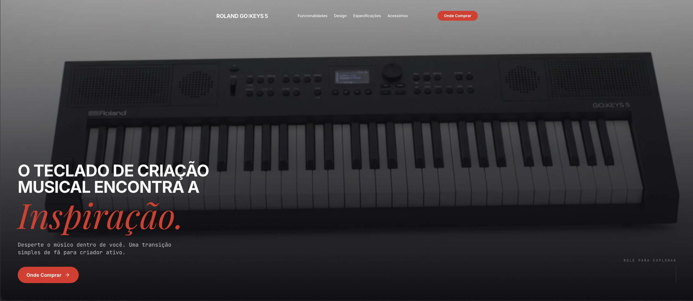

<div align="center">
  

# Roland GO:KEYS 5 - Landing Page

  <p>
    <strong>Uma experiência imersiva e moderna para apresentar o teclado de criação musical Roland GO:KEYS 5.</strong>
  </p>

  <p>
    <a href="#-sobre-o-projeto">Sobre</a> •
    <a href="#-tecnologias">Tecnologias</a> •
    <a href="#-funcionalidades">Funcionalidades</a> •
    <a href="#-como-executar">Como Executar</a> •
    <a href="#-licença">Licença</a>
  </p>

  <p>
    
    
    
    
  </p>
</div>

## 📖 Sobre o Projeto

O **GO:KEYS Site** é uma landing page de alta conversão, responsiva e interativa, desenvolvida para destacar as características premium do teclado musical Roland GO:KEYS 5. O projeto foca em uma interface de usuário elegante (UI), transições suaves e uma experiência de navegação otimizada (UX), refletindo a qualidade e o design do produto físico.

## 🚀 Tecnologias

Este projeto foi construído utilizando as melhores e mais atuais ferramentas do ecossistema front-end:

- **[React 19](https://react.dev/)** - Biblioteca JavaScript para construção de interfaces de usuário reativas.
- **[Vite 8](https://vitejs.dev/)** - Ferramenta de build de última geração, garantindo um ambiente de desenvolvimento super rápido.
- **[Tailwind CSS](https://tailwindcss.com/)** - Framework CSS utility-first para estilização ágil, consistente e responsiva.
- **[GSAP](https://gsap.com/)** - Biblioteca padrão-ouro da indústria para animações web complexas e de alta performance.
- **[Lucide React](https://lucide.dev/)** - Biblioteca de ícones moderna e customizável.

## ✨ Funcionalidades

- 🎨 **Design Premium e Responsivo:** Interface perfeitamente adaptável para desktops, tablets e smartphones (Mobile First).
- 💫 **Animações Fluidas:** Integração avançada com GSAP para criar interações e transições de página que retêm a atenção do usuário.
- ⚡ **Performance Extrema:** Arquitetura otimizada com Vite, garantindo tempos de carregamento mínimos e Core Web Vitals excelentes.
- 🧩 **Arquitetura Escalável:** Código limpo e estruturado baseado em componentes React reutilizáveis e de fácil manutenção.

## 🛠️ Como Executar

Siga as instruções abaixo para configurar e rodar o projeto em seu ambiente local de desenvolvimento.

### Pré-requisitos

Certifique-se de ter o **Node.js** (versão 18 ou superior) e um gerenciador de pacotes (npm, yarn ou pnpm) instalados na sua máquina.

### Instalação

1. Clone o repositório:

   ```bash
   git clone https://github.com/douglasaqsantos/gokeys-site.git
   ```

2. Acesse o diretório do projeto:

   ```bash
   cd gokeys-site
   ```

3. Instale as dependências:

   ```bash
   npm install
   # ou yarn install / pnpm install
   ```

4. Inicie o servidor de desenvolvimento:

   ```bash
   npm run dev
   # ou yarn dev / pnpm dev
   ```

5. Abra o seu navegador e acesse `http://localhost:5173`.

## 🤝 Contribuição

Contribuições são o que tornam a comunidade open source um lugar incrível para aprender, inspirar e criar. Qualquer contribuição que você fizer será **muito apreciada**.

1. Faça um Fork do projeto
2. Crie uma Branch para sua Feature (`git checkout -b feature/AmazingFeature`)
3. Faça o Commit de suas mudanças (`git commit -m 'feat: add some AmazingFeature'`)
4. Faça o Push para a Branch (`git push origin feature/AmazingFeature`)
5. Abra um Pull Request

## 📝 Licença

Este projeto está sob a licença MIT. Veja o arquivo [LICENSE](LICENSE) para mais detalhes.

---

<div align="center">
  Feito por <a href="https://github.com/douglasaqsantos">Douglas Santos</a>
</div>
